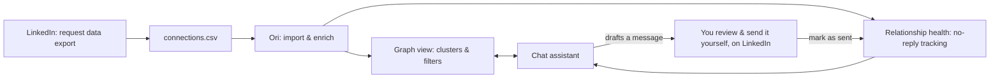

# Ori

**The graph view for your LinkedIn network — with an AI assistant that helps you find the right people and keep relationships warm, without ever automating LinkedIn itself.**

## What is this?

A LinkedIn network is a list. You scroll it, you can't use it. Ori turns your connections export into an interactive graph — clustered by company, role, industry, city — with a chat assistant that can query the graph, surface who's worth talking to, and draft outreach or follow-up messages for relationships that have gone cold. Every message is drafted for you and sent by you; the product never logs into LinkedIn or automates a send.

## How it works



## Why draft-only, not automated

Automated LinkedIn messaging violates LinkedIn's Terms of Service and risks getting user accounts flagged or banned. Ori only ever *reads* your network (via LinkedIn's own official, user-initiated data export) and *drafts* messages — it never logs in, scrapes, or sends on your behalf. See [Key Decisions in docs/PROJECT.md](docs/PROJECT.md#key-decisions) for the full reasoning.

## Status

Concept / planning stage — no code has been written yet. See `docs/TASKS.md` for what's actively being worked on.

## Docs in this folder

| File | What's in it |
|------|---------------|
| [`ori-project-idea.md`](ori-project-idea.md) | The full merged concept — problem, product, demo script, risks, open questions |
| [`docs/PROJECT.md`](docs/PROJECT.md) | The structured project brief — core value, requirements, constraints, key decisions, success metrics, tech stack |
| [`docs/TASKS.md`](docs/TASKS.md) | The current sprint's active tasks, blockers, and open questions |
| [`docs/PLAN.md`](docs/PLAN.md) | The full multi-phase roadmap and backlog |
| [`AGENTS.md`](AGENTS.md) | Operating instructions for any coding agent that works on this project |

`docs/ARCHITECTURE.md` doesn't exist yet on purpose — there's no real code structure to document until the MVP build starts.

## Folder structure

```
Ori/
├── README.md                 ← you are here
├── AGENTS.md                 ← agent operating instructions (symlinked as CLAUDE.md, GEMINI.md)
├── ori-project-idea.md       ← full merged concept doc
└── docs/
    ├── PROJECT.md             ← structured project brief
    ├── TASKS.md                ← current sprint
    └── PLAN.md                  ← full roadmap + backlog
```
