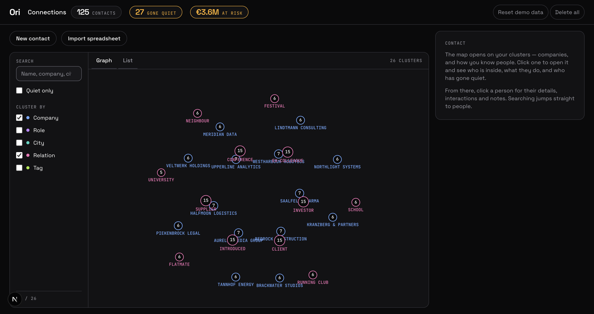
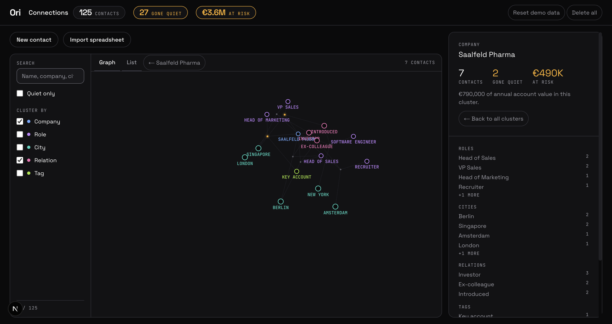
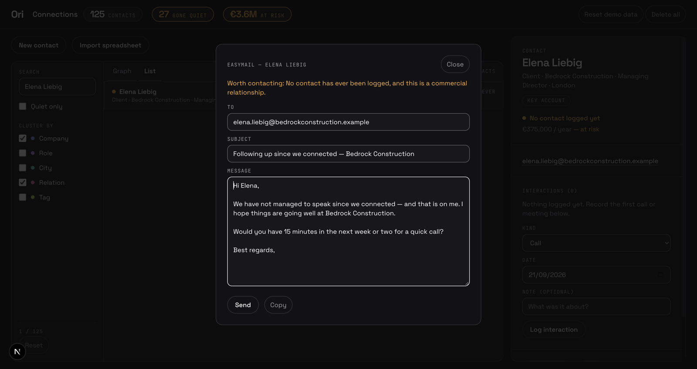
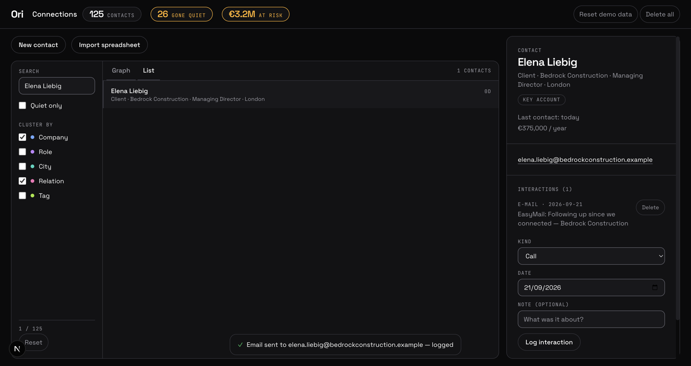
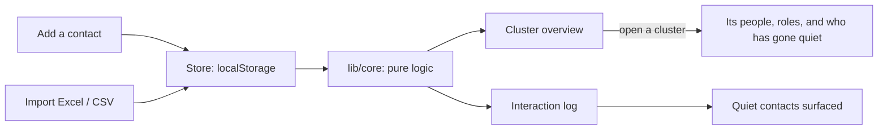

# Ori

**One map of everyone you know. It clusters your contacts by company, role, city and how
you know them, and it tells you which relationships have gone quiet.**

Built for the SBE business hackathon. Runs entirely in the browser — no sign-up, no server,
no database.



## The problem

An address book is a list. You scroll it, you don't use it. Nobody opens a CRM to remember
that the client who mattered last spring hasn't heard from them in seven months.

So two things go wrong, and both cost money:

1. **You cannot see the shape of your own network.** Which accounts are you deep in? Where
   is your reach one person thick? A list cannot answer that; a map can.
2. **Relationships decay silently.** There is no alert for "nothing happened". Ori makes the
   absence visible — a contact with no interaction for 90 days is marked, in the graph and
   in every cluster's headline number.

## What it does

- **Opens on your clusters, not on 125 nodes.** The first screen is your companies and how
  you know people, sized by headcount. Click one to open it and the people appear.
- **Tells you what a cluster is made of.** Open "Northlight Systems" and you get headcount,
  how many have gone quiet, the roles inside, and the names worth calling first.
- **Logs interactions per contact** — call, message, meeting, e-mail, note — and derives
  "last contacted" from them.
- **Imports Excel and CSV.** Recognises English and German headers in any order, skips
  title rows and legends, dedupes by e-mail case-insensitively, and shows a preview before
  writing anything.
- **Flags crowdsourced information.** A contact whose details came from somewhere other
  than the person themselves carries a visible caution. Provenance only — nothing is
  fetched from or sent to anywhere.

## What it looks like

**Open an account and it tells you what is inside it.** Saalfeld Pharma: seven contacts,
two of them cold, €490K of annual value at risk — plus the roles, cities and relations that
make up the account, and the names worth calling first.



**EasyMail writes the reconnect email from the contact's own record.** It knows you have
never spoken, it knows the company, and it knows this is a commercial relationship — so it
asks for fifteen minutes rather than a coffee. Deterministic, offline, no model call: every
sentence is derived from data already in the app.



**Sending closes the loop.** The email is logged, so the contact stops being counted as
quiet and their value comes out of "at risk" — 27 cold contacts become 26, €3.6M becomes
€3.2M, and the account drops off the cold list.



> The send itself is simulated in this build — there is no mail transport. The draft
> generation and the interaction logging are real. See the header of
> `components/easymail.tsx`.

## Run it

Prerequisites: Node 24 or newer, and npm. Nothing else — no Docker, no database, no `.env`.

```bash
npm install
npm run dev       # http://localhost:3000
```

The first visit seeds a demo network of ~125 invented contacts so there is something to
look at. **Reset demo data** rebuilds it; **Delete all** empties it.

```bash
npm run check     # 37 asserts: parser, graph build, filter math, dataset layer, clusters, EasyMail
npm run build     # must pass with zero type errors
npm run lint      # must be clean
```

## Where your data lives

In your browser's `localStorage`, and nowhere else. That means:

- It is **per browser and per device**. Nothing syncs.
- **Clearing site data deletes it.** There is no backup and no recovery.
- Nothing is uploaded, shared or transmitted. There is no account and no server to send it
  to.

This is a deliberate constraint for the hackathon build, not an oversight. Anything genuinely
multi-user — shared accounts, team handover, actually exchanging a contact with someone —
needs a backend, and that is a product decision that has not been taken yet.

## Why no LinkedIn login

Ori never logs in anywhere for you, never scrapes a profile, and never sends a message on
your behalf. Automated LinkedIn messaging breaks LinkedIn's terms of service and risks
getting real accounts banned. Any future platform connection would go through an
integration the **user** connects themselves, and every message would stay a draft a human
sends. There is no send path in this codebase.

## How it fits together



The rule that keeps it maintainable: **all logic lives in `lib/core/` and is pure.** Every
function takes the dataset and returns a value or a new dataset. It never touches
`localStorage`, `window` or React — which is why the whole thing is testable in Node with
`npm run check`, with no browser and no database.

```
app/          pages and layout (dashboard, import)
components/   React components
lib/core/     all business logic, framework-free and pure
lib/store/    localStorage persistence, the demo seed, the React binding
docs/
```

**No person-to-person edges.** Nodes are either a person or an attribute (company, role,
city, relation, tag), and people link only to their own attributes. 125 contacts sharing a
city would otherwise be thousands of edges. There is no edge table: edges are derived from
contact attributes at render time.

## Docs

| File | Contents |
|------|----------|
| [`AGENTS.md`](AGENTS.md) | Working instructions for coding agents, plus stack, layering, graph model and design system (linked as `CLAUDE.md`, `GEMINI.md`) |
| [`docs/ARCHITECTURE.md`](docs/ARCHITECTURE.md) | The built architecture: module map, data model, import pipeline, graph build |
| [`docs/PROJECT.md`](docs/PROJECT.md) | Project brief: core value, requirements, constraints, key decisions |
| [`docs/TASKS.md`](docs/TASKS.md) | Current sprint, blockers, open questions |
| [`docs/PLAN.md`](docs/PLAN.md) | Roadmap and backlog |

Some documents under `docs/` still describe the earlier three-network, Supabase-backed
design and are being brought up to date; `docs/ARCHITECTURE-TARGET.md` in particular
proposes LinkedIn browser automation and contradicts the rule above. `AGENTS.md` and this
file are the current source of truth.
