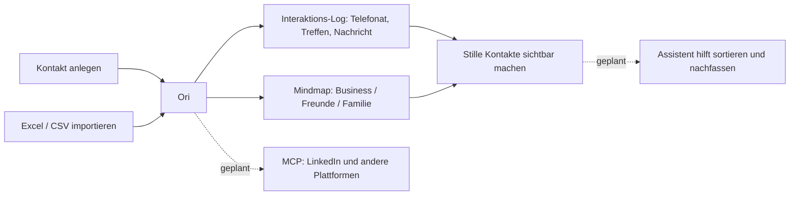

# Ori

**Drei Mindmaps deines Netzwerks — Business, Freunde, Familie. Du legst dein Netzwerk selbst
an, Ori zeigt es als Graph statt als Liste und merkt sich, wann du wen zuletzt erreicht hast.**

## Was ist das?

Ein Adressbuch ist eine Liste. Du scrollst sie, aber du benutzt sie nicht. Ori macht daraus
drei durchschaltbare Graphen — geclustert nach Firma, Rolle, Stadt, Beziehung und Tags — und
protokolliert pro Kontakt, wann du zuletzt telefoniert, geschrieben oder dich getroffen hast.
Was still geworden ist, siehst du im Graph.

Kontakte kommen per Formular rein oder per Excel-/CSV-Import. Ein Assistent, der beim
Sortieren und Pflegen hilft, und MCP-Verbindungen zu LinkedIn und anderen Plattformen sind
geplant, aber im MVP nicht gebaut.

## Wie es funktioniert



## Warum kein LinkedIn-Login

Ori loggt sich nirgends für dich ein, scrapt keine Profile und verschickt keine Nachrichten
in deinem Namen. Automatisiertes LinkedIn-Messaging verstößt gegen die LinkedIn-ToS und
riskiert die Sperrung echter Nutzerkonten. Künftige Plattform-Anbindungen laufen über
MCP-Server, die der **Nutzer** selbst verbindet, und jede Nachricht bleibt ein Entwurf, den
der Mensch selbst abschickt. Siehe [Key Decisions in docs/PROJECT.md](docs/PROJECT.md#key-decisions).

## Status

MVP im Bau. Next.js 16 + Supabase, läuft vollständig lokal. Nichts ist deployed.
Was gerade dran ist, steht in `docs/TASKS.md`.

## Lokal starten

Voraussetzungen: Node 24, npm, [OrbStack](https://orbstack.dev) (oder Docker Desktop),
[Supabase CLI](https://supabase.com/docs/guides/cli).

```bash
npm install
supabase start                  # startet Postgres, Auth und Studio in Docker
cp .env.example .env.local      # dann die von `supabase start` ausgegebenen Keys eintragen
supabase db reset               # Migrationen + Seed einspielen
npm run dev                     # http://localhost:3000
```

Demo-Login aus dem Seed: `demo@ori.local` / `demo12345`.
Bestätigungsmails landen lokal in Mailpit auf http://127.0.0.1:54324, nicht in einem echten
Postfach. Details in [`docs/LOCAL_SETUP.md`](docs/LOCAL_SETUP.md).

```bash
npm run check      # Asserts für Parser, Graph-Bau und Filter
npm run build      # muss mit null Typfehlern durchlaufen
supabase db reset  # muss jederzeit sauber von leer replayen
```

## Docs

| Datei | Inhalt |
|------|---------------|
| [`AGENTS.md`](AGENTS.md) | Arbeitsanweisungen für Coding-Agents, plus Stack, Layering, Graph-Modell und Design-System (verlinkt als `CLAUDE.md`, `GEMINI.md`) |
| [`docs/ARCHITECTURE.md`](docs/ARCHITECTURE.md) | Die gebaute Architektur: Modulkarte, Schema, Import-Pipeline, Graph-Bau |
| [`docs/ARCHITECTURE-TARGET.md`](docs/ARCHITECTURE-TARGET.md) | Ein älteres Produkt-Zieldokument, das LinkedIn-Browser-Automation vorschlägt und damit den Regeln oben widerspricht — offene Team-Entscheidung, siehe `docs/TASKS.md` |
| [`docs/BUILD_PLAN.md`](docs/BUILD_PLAN.md) | Die Phasen des MVP-Builds mit Owner und Definition of Done |
| [`docs/LOCAL_SETUP.md`](docs/LOCAL_SETUP.md) | OrbStack, Supabase, Migrationen, Seed |
| [`docs/PROJECT.md`](docs/PROJECT.md) | Projekt-Brief: Kernnutzen, Anforderungen, Constraints, Key Decisions |
| [`docs/TASKS.md`](docs/TASKS.md) | Aktueller Sprint, Blocker, offene Fragen |
| [`docs/PLAN.md`](docs/PLAN.md) | Roadmap und Backlog |
| [`ori-project-idea.md`](ori-project-idea.md) | Das ursprüngliche Konzept. Historisch — der Scope hat sich seitdem geändert, siehe `docs/PROJECT.md` |

## Ordnerstruktur

```
ori/
├── app/              Seiten und Layout (Login, Dashboard je Netzwerk, Import)
├── components/       React-Komponenten
├── lib/
│   ├── core/         alle Businesslogik, framework-frei
│   ├── actions/      Server Actions, dünne Adapter
│   └── supabase/     Client-Factories
├── supabase/         Migrationen, seed.sql, config.toml
├── docs/
├── proxy.ts          Session-Refresh und /dashboard-Schutz (Next.js 16)
└── AGENTS.md
```
