# PLAN.md — Ori

> The full project roadmap across all sprints and phases. `docs/TASKS.md` tracks only the
> *current* sprint and gets reset each time — finished tasks get copied here first.

## Roadmap

```mermaid
gantt
    title Ori roadmap (phases, not calendar-fixed)
    dateFormat  X
    axisFormat  %s
    section Phase 1 — Validation
    Scope and compliance decisions      :p1, 0, 1
    section Phase 2 — MVP
    Schema, RLS, seed                   :p2a, after p1, 1
    Core modules + import               :p2b, after p1, 1
    Three mindmaps, filters, panel      :p2c, after p2b, 1
    section Phase 3 — Assistant
    One job it does well                :p3a, after p2c, 1
    MCP server over the same core       :p3b, after p3a, 1
    section Phase 4 — Platform connections
    User-attached MCP sources           :p4, after p3b, 1
    section Phase 5 — Productize
    Stripe checkout + onboarding        :p5, after p4, 1
    section Phase 6 — Launch
    Free trial + growth loops           :p6, after p5, 1
```

### Phase 1 — Validation (done)
- [x] Decide the product shape: three self-filled networks, not a LinkedIn-export graph
- [x] Hold the line on no scraping and no automated sending
- [ ] Resolve the contradiction with `docs/ARCHITECTURE-TARGET.md` explicitly

### Phase 2 — MVP (current)
- [ ] Schema, RLS and seed for `contacts` + `interactions`
- [ ] Core modules: spreadsheet import, bipartite graph build, filter, read projection
- [ ] Three switchable mindmaps with filters, contact panel and interaction log
- [ ] Manual contact form and spreadsheet import with preview

### Phase 3 — Assistant
- [ ] Pick the one job it does first: cleaning up and tagging the network, or suggesting who
      to contact next. Not a chat box on top of a graph.
- [ ] Tool registry under `lib/core/tools/`, one route handler, same core modules
- [ ] MCP server exposing the same registry, so external clients get the same capabilities
- [ ] Message drafting with an explicit "als gesendet markieren" step — never an auto-send

### Phase 4 — Platform connections
- [ ] MCP connections the user attaches themselves, LinkedIn and others, read-only first
- [ ] Merge imported contacts into existing ones without creating duplicates

### Phase 5 — Productize
- [ ] Stripe subscription checkout
- [ ] Onboarding wizard (purchase → first network → guided first import)
- [ ] Marketing landing page

### Phase 6 — Launch & grow
- [ ] Free trial, referral loop, community outreach
- [ ] Analytics on which contacts actually get revived

## Sprint History

Completed sprint tasks get copied here as each sprint resets.

**Sprint 0 — Planning & Validation** (2026-09-21, closed)
- Merged the two original concept docs into one coherent concept — `ori-project-idea.md`
- Wrote `README.md`, `docs/PROJECT.md` and `AGENTS.md` scaffolding
- Wrote the first target architecture (`docs/ARCHITECTURE-TARGET.md`), which surfaced the
  scraping contradiction that is still open
- Rescoped the product to three self-filled networks, which retired the LinkedIn-export plan

## Backlog (not yet scheduled)

- Tree layout for the family network, if the cluster graph reads badly with real data
- Column-mapping UI for imports, if the alias table plus template is not enough
- Two-person "compare networks" view
- Merging duplicate contacts across networks
- Reminders and timing suggestions for contacts that have gone quiet
