# PLAN.md — Ori

> The full project roadmap across all sprints and phases. `docs/TASKS.md` tracks only the *current* sprint and gets reset each time — finished tasks get copied here first.

## Roadmap

```mermaid
gantt
    title Ori roadmap (phases, not calendar-fixed)
    dateFormat  X
    axisFormat  %s
    section Phase 1 — Validation
    Compliance & naming decisions       :p1, 0, 1
    section Phase 2 — MVP
    CSV import + enrichment             :p2a, after p1, 1
    Graph view + filters                :p2b, after p1, 1
    Chat assistant (search/filter)      :p2c, after p2a, 1
    section Phase 3 — Relationship layer
    Message drafting + no-reply track   :p3a, after p2c, 1
    Reminders + dashboard               :p3b, after p3a, 1
    section Phase 4 — Productize
    Stripe checkout + onboarding        :p4, after p3b, 1
    section Phase 5 — Launch
    Free trial + growth loops           :p5, after p4, 1
```

### Phase 1 — Validation (current)
- [ ] Confirm the human-in-the-loop messaging model is acceptable to target users
- [ ] Everyone on the team requests their LinkedIn export
- [ ] Decide product name and assistant delivery mode (in-app panel vs. MCP-client-as-view)

### Phase 2 — MVP
- [ ] CSV import, normalization, role-family enrichment
- [ ] Graph view with clustering and filters
- [ ] Chat assistant with `search_network`, `get_clusters`, `set_filter`

### Phase 3 — Relationship layer
- [ ] Message drafting + manual "mark as sent" + no-reply tracking
- [ ] Follow-up reminders and timing suggestions
- [ ] Connections / relationship-health dashboard

### Phase 4 — Productize
- [ ] Stripe subscription checkout
- [ ] Onboarding wizard (purchase → connect → guided first run)
- [ ] Marketing landing page

### Phase 5 — Launch & grow
- [ ] Free trial, referral loop, community outreach
- [ ] Analytics on relationship health, premium tier

## Sprint History

Completed sprint tasks get copied here as each sprint resets.

**Sprint 0 — Planning & Validation** (started 2026-09-21, still active)
- Nothing finished yet — see `docs/TASKS.md` for what's in progress.

## Backlog (not yet scheduled)

- Friends & family network expansion (same data model, later)
- Two-person "compare networks" view
- Browser extension / bookmarklet to reduce copy-paste friction for drafted messages
